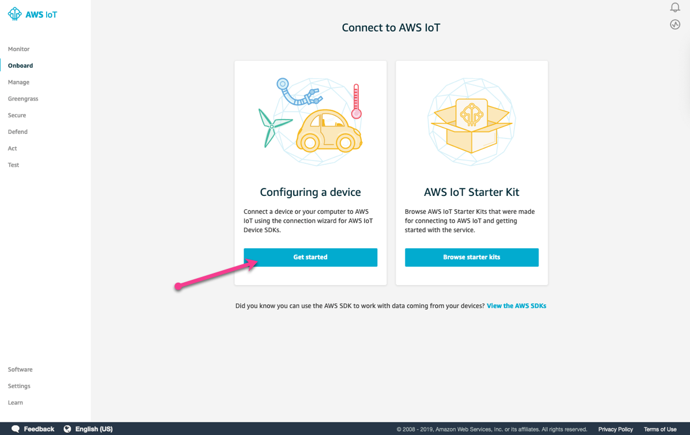
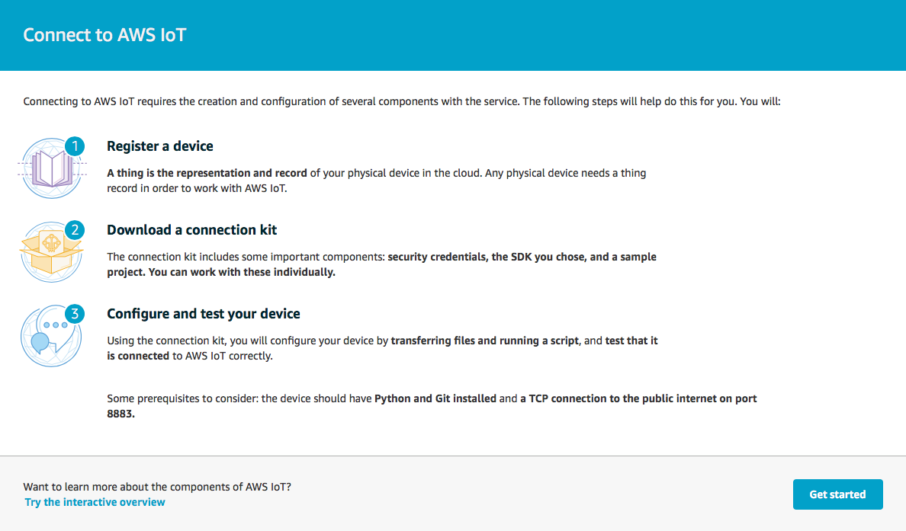
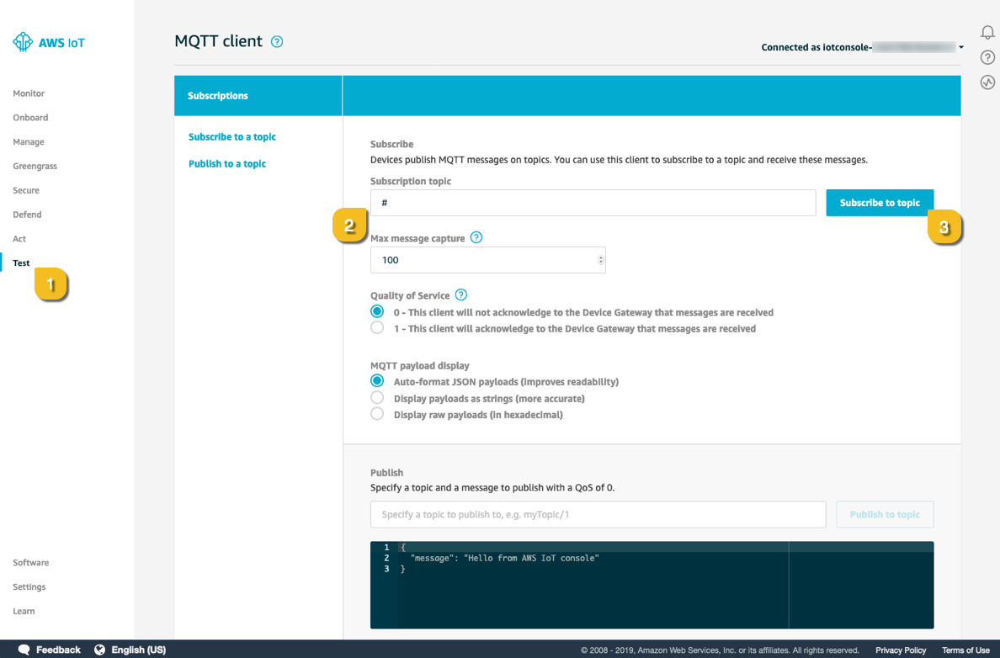

## Alexa Workshop Guide : Smart Home Session

This section introducts how to create an thing and interact with the thing using AWS Iot Core.

##	Step 1 - Creating your first “Thing”, security policies and certificates.
Let’s get your account setup with a new Thing, certificates and security policies.

Log into your AWS console and make sure you can access the AWS IoT dashboard. It should like the following:


Let’s create our first “thing” and setup the policy and certificates for this to work.

If you’ve used an older console in the past you’ll notice we have a very new dashboard and the process of setting up the thing and certificates is very streamlined.


##	Step 2 - Connect Wizard
In the above screenshot you’ll see a “Connect” menu option. Select this to continue.

You’ll now see this screen:



We’re going to select “Configuring a device” - click the getting started button.

Next we’re going to pick our target operating system and development language. This is used to generate a full package for us to quickly connect to AWS IoT.


For the hardware we’re working on today let’s pick Linux/OSX as our platform and Pythong for our SDK.

You will now see this screen



##	Step 3 - Creating Things
Ok so now we’re ready to get started. Click getting started and then enter a name for your new Thing.


For these labs let’s call our new thing, ratchet. Enter this name and click Next step.

Tip:If you’re using a shared account, add your initials to this name, e.g. cwratchet

On the next screen you can see that everything has been generated for you!


So let’s see exactly what was generated.

*	You’ll notice a security policy has been created for you allowing you to immediately send and receive messages.
*	A start.sh script has been created, this script will download any additional files needed including a sample application.
*	Finally, a Linux/OSX zip file containing all your certificates.

Make sure you click the Linux/OSX link to download the connection package.

Note - Do not lose this zip file, it contains your private key file which cannot be retrieved again.

Once you have downloaded the zip file you’ll be able to click the Next step link.

Click Done to complete the Wizard


Note: Do not run the scripts on the last page of the wizard, just click Done. Those scripts are not used.


##	Step 4 - Adjust our “Thing” Security Policy
The default security policy created by the above wizard will limit the topics your device can publish on. For the labs in this workshop we’re going to create a more open policy. So we need to find and edit the policy that has been created already.

*	In the IoT Console click on Manage - it will default to Things.
*	Find the thing you just created, in this case look for ratchet.
*	Click on your device to see it’s details.
*	Click on Security.
*	Click on the attached certificate - see below


*	You will see your certificate details.
*	Click on Policies

[](img/lab1-16.png)

*	Click on your policy, usually that’s ratchet-Policy.
*	Click Edit Policy Document
*	Enter the following for your document.

```
{
  "Version": "2012-10-17",
  "Statement": [
    {
      "Effect": "Allow",
      "Action": [
        "iot:Publish",
        "iot:Subscribe",
        "iot:Connect",
        "iot:Receive"
      ],
      "Resource": [
        "*"
      ]
    }
  ]
}
```
*	Click Save as new version

[](img/lab1-17.png)

That’s it! your device can now publish and subscribe to any topics.

##	Step 5 - Quick Review
Let’s have a quick review.

*	Your certificates have been created and activated for you.
*	A security policy has been created and modified for the access we need.
*	The certificate and security policy have been attached to the thing “ratchet” that you created.

The above are the three requirement components to use AWS IoT.

## Step 6 - Configure your local credentials

* install [awscli](https://aws.amazon.com/cn/cli/) by running 

```
pip install awscli
```

* Run 'aws configure' to configure your local AKSK & set region cofiguration.

* Make sure your AWS REGION in the code is correct! Look at the mqttc.configureEndpoint and make sure it matches.
* Make sure your certificates are in the same location as the file you’re running or edit the code with the part of your certificates.

## Step 7 - Run the Code

Extract the certificates from the zip file you downloaded above.

*  rootCA.pem is the same for all devices, we have already have it [here](https://github.com/lab798/aws-alexa-workshop-smarthome-lamp/blob/master/credentials/rootCA.pem) that is downloaded from https://www.amazontrust.com/repository/AmazonRootCA1.pem
*  privateKey.pem is ratchet.private.key file from the ZIP file
*  certificate.pem is ratchet.cert.pem file from the ZIP file

And the sample code goes like this, you could also download it [here](https://github.com/lab798/aws-alexa-workshop-smarthome-lamp/blob/master/sample.py).  run it by using command

```
python sample.py'
```

If anything goes wrong, please check the following thing:
* You are NOT using your company's internal network. Most companies IT block 8443 port for security reason. Please use your own network or a guest network. 

```
#!/usr/bin/python

# Lab 1 - Setting up.
# Make sure your host and region are correct.

import sys
import ssl
from AWSIoTPythonSDK.MQTTLib import AWSIoTMQTTClient
import json
import time

#Setup our MQTT client and security certificates
#Make sure your certificate names match what you downloaded from AWS IoT

mqttc = AWSIoTMQTTClient("1234")

#Use the endpoint from the settings page in the IoT console

# If you are using an internal network, you will meet the error "connection refused"
# Please use a guest network that is not blocking 8883
mqttc.configureEndpoint("data.iot.us-west-2.amazonaws.com",8883)

# rootCA.pem is the same for all devices
# privateKey.pem is device-name.private.key from the ZIP file
# certificate.pem is device-name.cert.pem from the ZIP file

mqttc.configureCredentials("credentials/rootCA.pem","credentials/privateKey.pem","credentials/certificate.pem")

#Function to encode a payload into JSON
def json_encode(string):
        return json.dumps(string)

mqttc.json_encode=json_encode

#Declaring our variables
message ={
  'val1': "Value 1",
  'val2': "Value 2",
  'val3': "Value 3",
  'message': "Test Message"
}

#Encoding into JSON
message = mqttc.json_encode(message)

#This sends our test message to the iot topic
def send():
    mqttc.publish("iot", message, 0)
    print "Message Published"


#Connect to the gateway
mqttc.connect()
print "Connected"

#Loop until terminated
while True:
    send()
    time.sleep(5)

mqttc.disconnect()

#To check and see if your message was published to the message broker go to the MQTT Client and subscribe to the iot topic and you should see your JSON Payload


```

## Step 7 - Test 

To check and see if your message was published to the message broker go to the MQTT Client and subscribe to the iot topic and you should see your JSON Payload.

* Open the IoT Console
* Click on Test
* Subscribe to #




