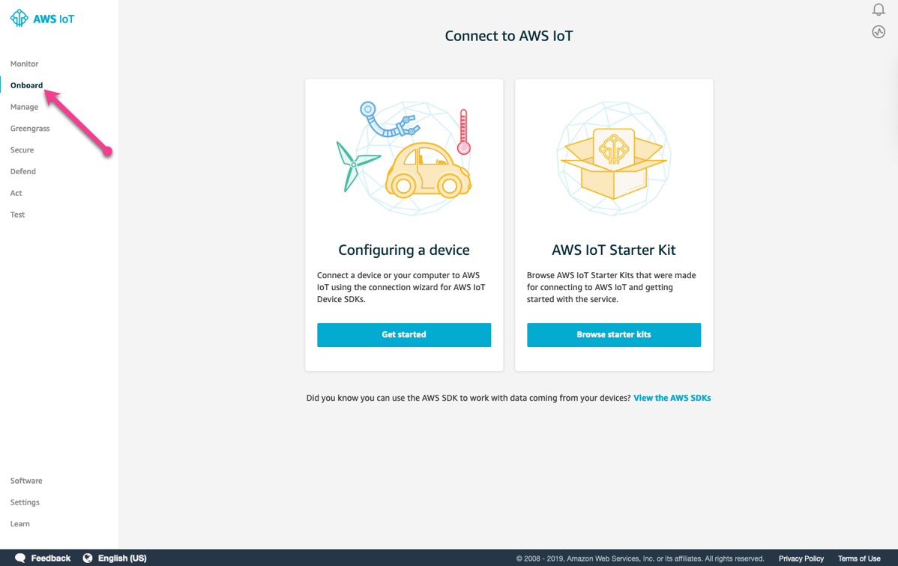
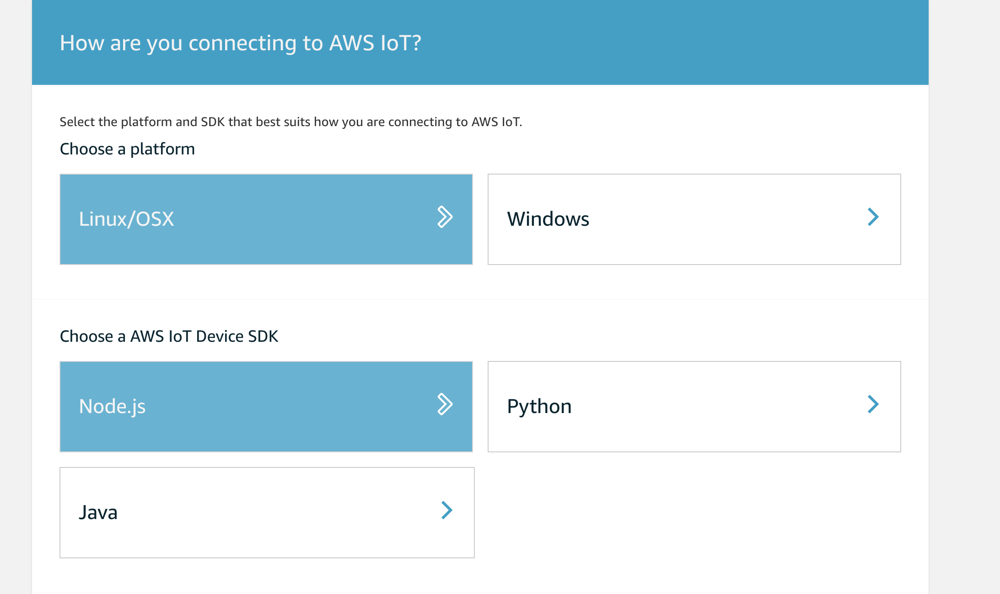
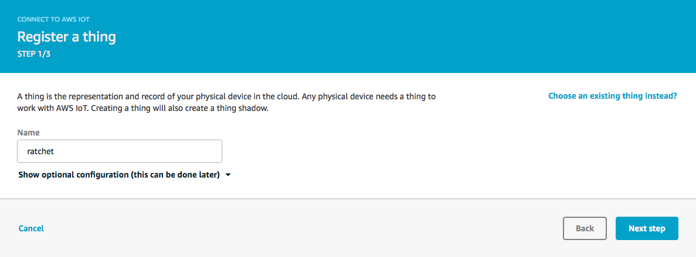
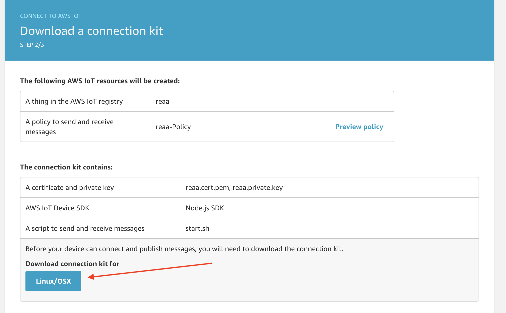
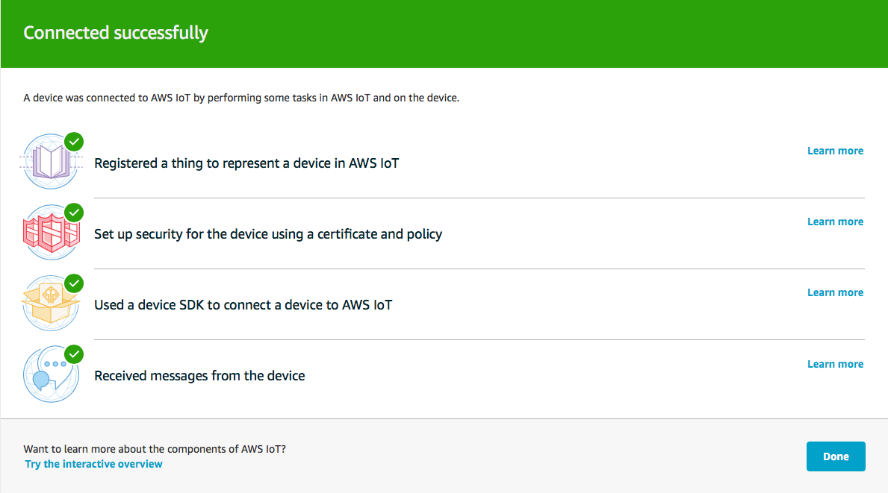
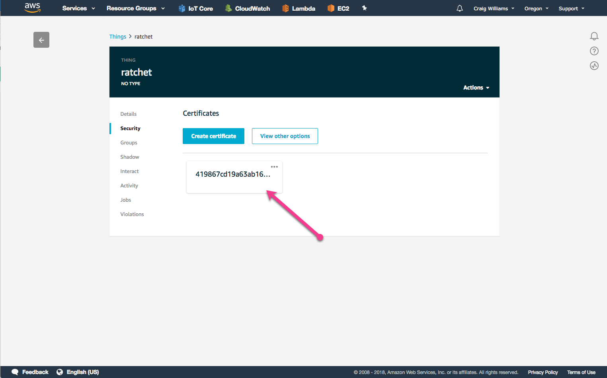
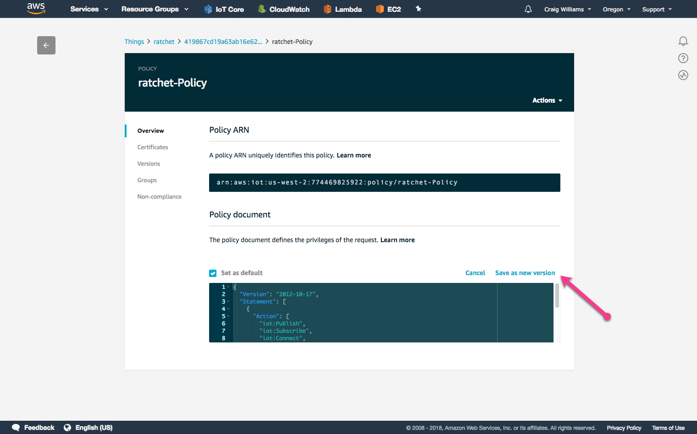
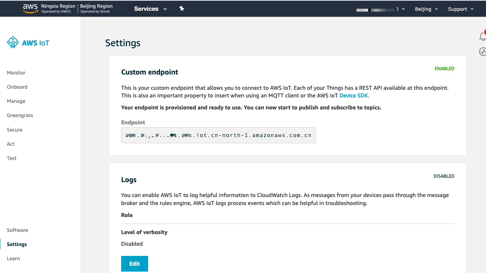
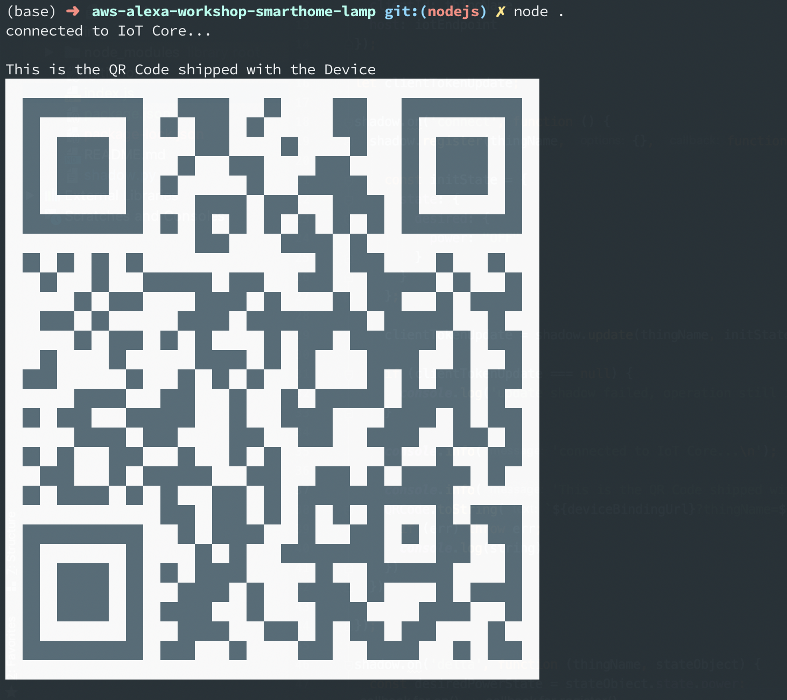
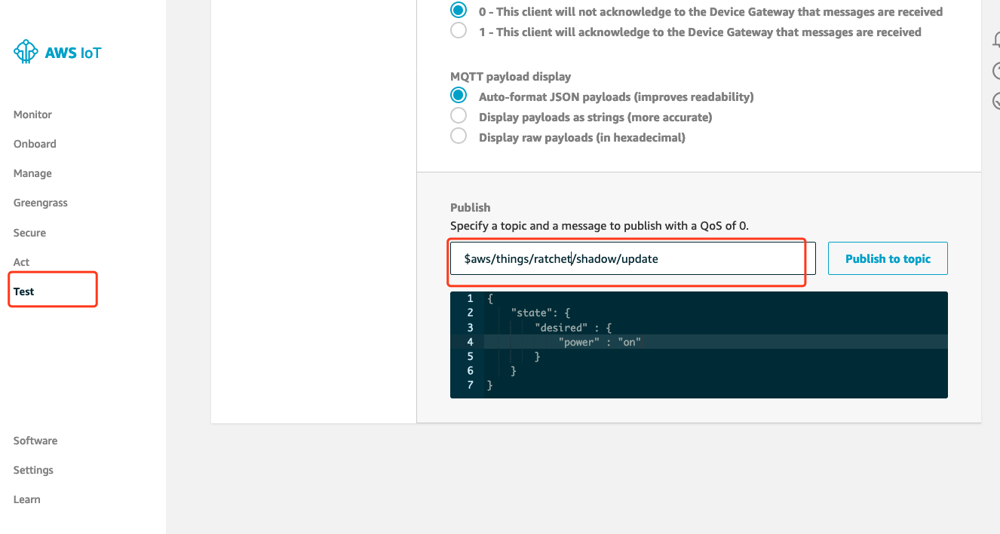

# Build A Smart Lamp Simulator

This article introduces how to create a virtual Lamp and interact with 
AWS Iot Core.

##  Table of Contents
1. [Create a Thing on AWS IoT Console](#create-a-thing-on-aws-iot-console)
1. [Modify Default Policy](#modify-default-policy)
1. [Subscribe to IoT Core](#subscribe-to-iot-core)
1. [Test Shadow](#test-shadow)

## Create a Thing on AWS IoT Console
Let’s get your account setup with a new Thing, certificates and security policies.

1. Log into your AWS console and make sure you can access the AWS IoT dashboard. It should like 
the following. Let’s create our first “thing” and setup the policy and certificates for this to work.


1. In the above screenshots, you’ll see a **Onboard** menu option. Select this to continue

1. Under **Configuring a device**, click the **Getting Started** button

1. On **How are you connecting to AWS IoT?** page, select the platform; choose **Python** for IoT 
Device SDK. This is used to generate a full package for us to quickly connect to AWS IoT. 
Choose **Next** to continue


1. Enter `ratchet` for the **Name** field, and click **Next step** 


    > If you’re using a shared account, add your initials to this name, e.g. cwratchet

1. Everything has been generated for you! Click the button under **Download connection kit for** to download the package. 
Once you have downloaded the zip file you’ll be able to click the Next step link.



To summary, the following contents have been created:
* A security **policy** allow device to send and receive messages
* A Linux/OSX zip file containing all certificates

> Note - **Do not lose this zip file, it contains your private key file which cannot be retrieved again.**
> Do not need to run the scripts on the last page of the wizard, just click Done.

## Modify Default Policy
The default security policy created by the above wizard will limit the 
topics your device can publish on. For the labs in this workshop we’re going 
to create a more open policy. So we need to find and edit the policy that has been 
created already.

1. On the IoT Console click on **Manage** - it will default to **Things**

1. Find the thing you just created, for example **ratchet** in this lab

1. Click on your device to see it’s details

1. Click on **Security**

1. Click on the attached certificate - see below


1. Click on **Policies**
[](img/lab1-16.png)

1. Click on your policy, in this lab it is named **ratchet-Policy**

1. Click **Edit Policy Document**

1. Enter the following for your document
    ```
    {
      "Version": "2012-10-17",
      "Statement": [
        {
          "Effect": "Allow",
          "Action": [
            "iot:Publish",
            "iot:Subscribe",
            "iot:Connect",
            "iot:Receive"
          ],
          "Resource": [
            "*"
          ]
        }
      ]
    }
    ```

1. Click **Save as new version**


Your device can now publish and subscribe to any topics. So far, three required 
components to use AWS IoT have been created:
* Device certificates
* A security policy and being modified for the permission we need
* The certificate and security policy have been attached to the thing `ratchet`

## Subscribe to IoT Core

> You should NOT using your company's internal network. Most companies IT block 8883 port for security reason. 
> Please use your own network or a guest network. 

1. Git clone this repo

1. Extract the certificates & SDK from the zip file you downloaded above. You will get the following things.
   - A **private key** named `<thing-name>.private.key`
   - A **device certificate** named `<thing-name>.cert.pem`

1. Rename the private key to **private.key** and put in **credentials** folder. 
Rename the certificate to **cert.pem** and put in **credentials** folder

1. Change configurations in [`index.js`](./index.js)
   - `iotEndpoint`. You could find it in Iot console - settings
   - `thingName`. The name of created thing 
   - `deviceBindingUrl`. It is the url where you deployed in the [Device Binding UI](https://github.com/lab798/aws-alexa-workshop-ui).
      If you followed the guide, please go to AWS Amplify Console to find it, which named **Production branch URL**


1. Install dependencies. In this lab, [qrcode](https://www.npmjs.com/package/qrcode) is being used to 
generate a QR code which links to the Device Binding URL. 
    ```
    npm install
    ```

1. Run `node index.js` to start the application. 

The program listens to shadow information and send reported status to IoT core. In real life, you make sure that 
the device's status has been changed before you send reported status. Here, since we don't have hardware in this 
session, we simply report back as soon as we receive the delta.   

The virtual lamp output the QRCode content to its terminal. 



## Test Shadow 

In the lab, we demo the on & off status of the device by sending to the topic below.
```
$aws/things/<thing-name>/shadow/update
```

the shadow message should looks like this 
```
{
    "state": {
      "desired": {
        "power": "ON"
      }
    }
}
```


You could also see  outputs from the device simulator terminal, for example **turn ON Smart Lamp**.

For more information upon shadow, please check [using shadows](https://docs.aws.amazon.com/zh_cn/iot/latest/developerguide/using-device-shadows.html)

Next, return to [AWS-Alexa Workshop Smart Home](https://github.com/lab798/aws-alexa-workshop-smarthome),
and click [Bind Smart Lamp to User](https://github.com/lab798/aws-alexa-workshop-smarthome/blob/master/docs/bind-device.md).

